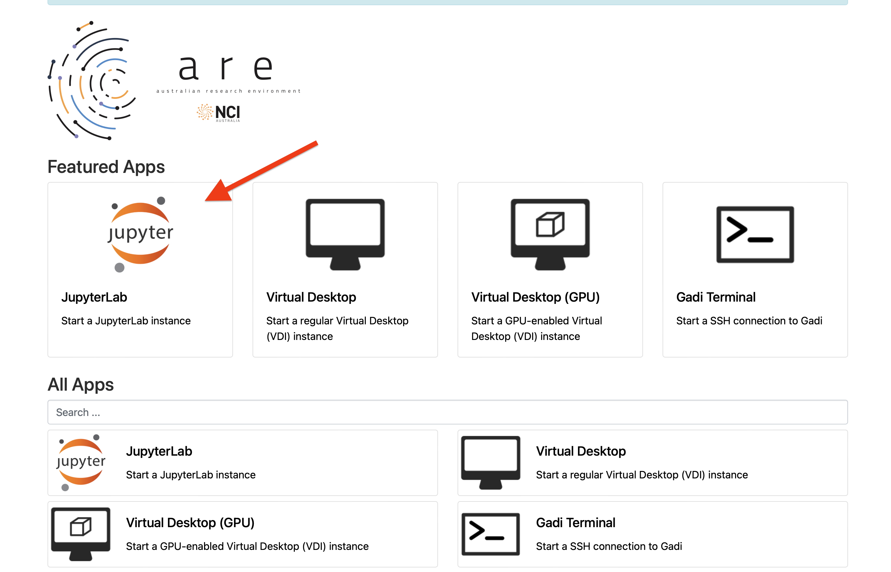

# Guide to Launch JupyterLab on ARE
## ParallelPython  
This quick guide demonstrates the material and environment setup required for the workshop.
## Prerequisite
Project membership:  
 - [vp91](https://my.nci.org.au/mancini/project/vp91/join) *(Note: after the request is approved, the system takes around 20-30 mins update your account.)* 

## Step 1. Make User Directory
Create a username directory under /scratch/vp91:  

```bash
mkdir /scratch/vp91/$USER
```

This should be the place where you store all your training material.

## Step 2.  Clone GitHub Repo
The material and data for today’s session are available in our public GitHub repository, clone it to the folder above.   
```bash 
cd /scratch/vp91/$USER    
git clone https://github.com/NCI900-Training-Organisation/parallelPython.git  
```   
    

## Step 3.  Prepare JypyterLab in ARE
At your browser go to [are.nci.org.au](https://are.nci.org.au/), login with your NCI account. At the interface go to **JupyterLab**.    
  

## Step 4.  Configure Job Settings
The parameters depend on the content of the workshop. Below are general use only **unless specified by your instructor**.   

**Queue**: `normal` *(Note: this is a free text field)*  
**Compute size**:  `small`    
**Project**: `vp91`  
**Storage**: `scratch/vp91`     *(Note: No starting slash)*

## Step 5.  Configure Modules and Environments
Below are examples only. Please check the workshop resources for correct settings.   

Click on the **Advanced options**   
  
  
**Modules**: `python3/3.11.0 papi/7.0.1 openmpi/4.0.1 cuda/12.3.2`   *(Note: One space only between modules)*   
**Python or Conda virtual environment base**: 
`/scratch/vp91/Training-Venv/intro-parallel-prog`  


